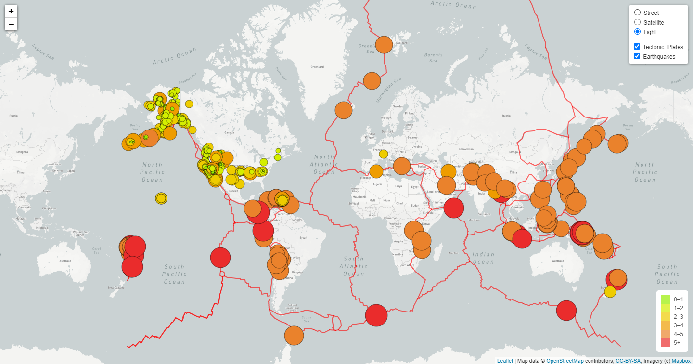

# Mapping_Earthquakes
## Earthquake_Challenge

The GeoJSON data has been used to map tectonic activity in the last 7 days on a world map.  The magnitude and intensity of the earthquakes are represented by the color and size of the circles.  A legend has been added to quickly provide information of the magnitude of the earthquakes.  A tectonic plates layer has been added to the map for reference.  Additionally, three choices of views have been presented.  Leaflet library has been used to provide mapping features to the code.

